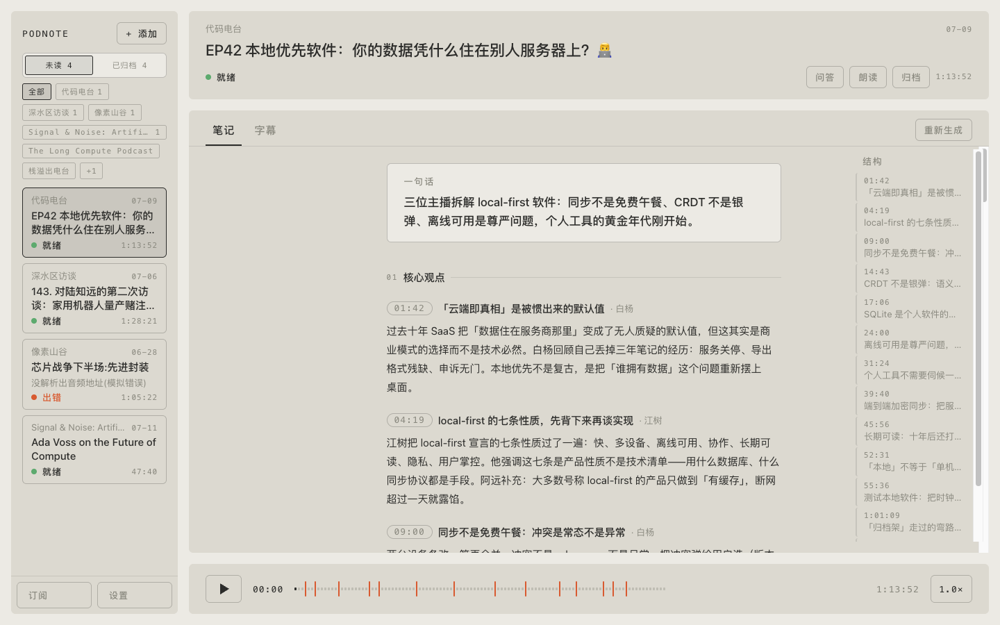
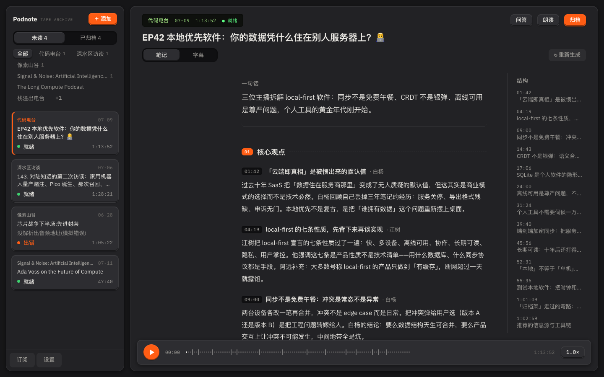
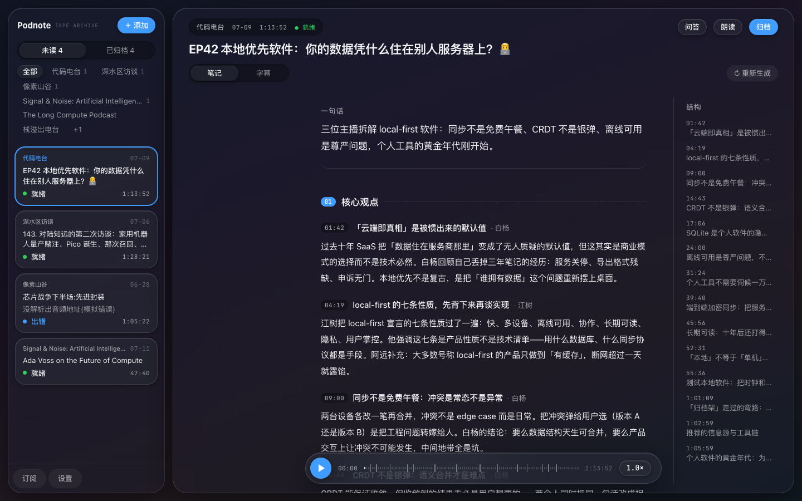
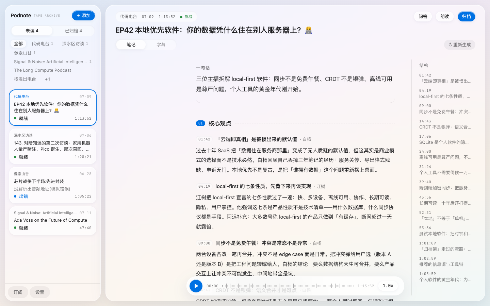
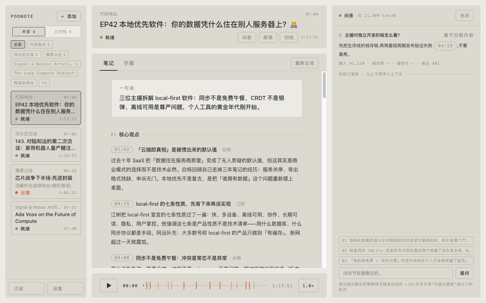
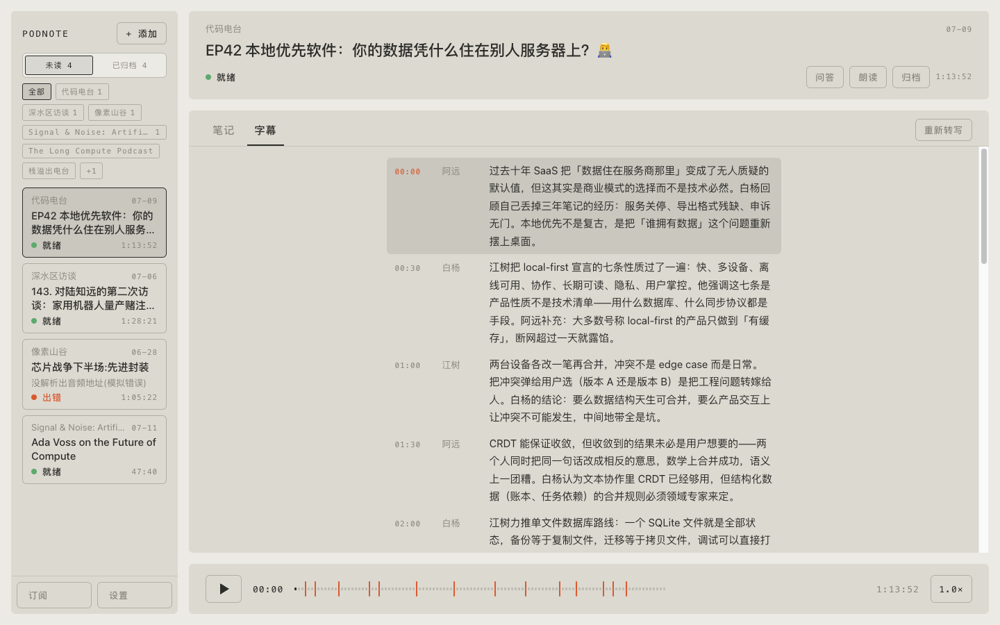
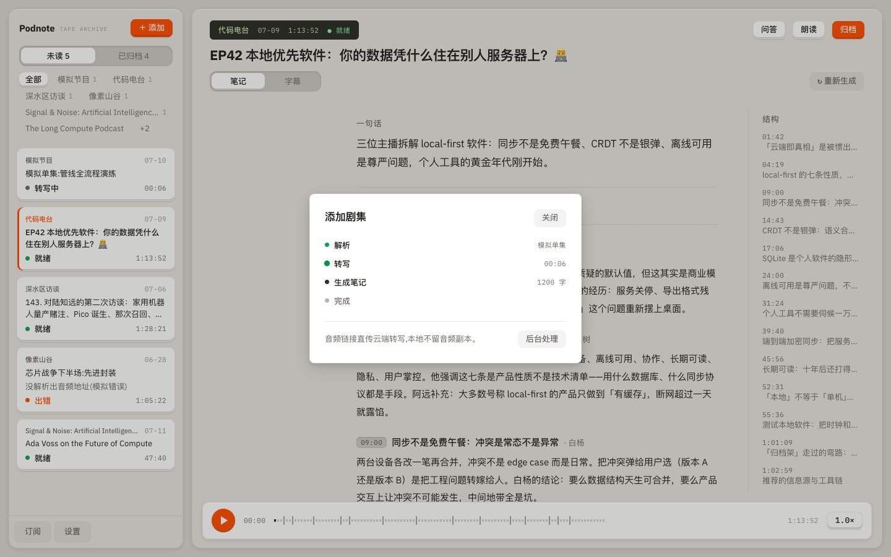
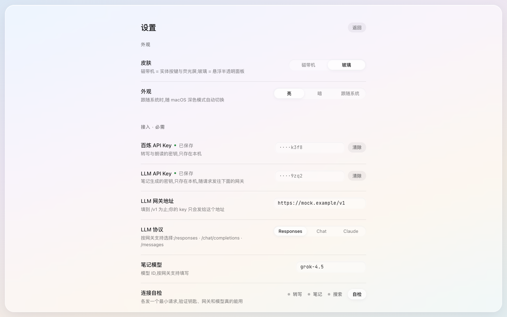

# Podnote

本地单机的播客笔记仪器(macOS / Windows beta)。

粘贴一条[小宇宙](https://www.xiaoyuzhoufm.com/)单集链接 → 云端转写(阿里百炼 fun-asr,含说话人分离)→ LLM 生成带归属的结构化中文笔记。笔记是收听的伴生品:每条观点、每句原话都带时间戳,点击回跳重听,而不是替代收听。



## 两种皮肤 × 亮暗外观

内置两张皮:**磁带机**(实体按键 + LCD 荧光屏)与**玻璃**(悬浮半透明面板),各配亮/暗外观(可跟随系统),设置页即点即换,切换时新主题从屏幕中心圆形扩散铺开。

| 磁带机 | 玻璃 |
|---|---|
|  |  |
|  |  |

## 界面

| | |
|---|---|
|  |  |
| **单集 AI 问答** — 基于完整转写稿提问,答案带可点击时间戳,用量透明(玻璃 · 暗色) | **字幕** — 说话人分离 + 逐句时间戳,点击回跳重听(磁带机 · 暗色) |
|  |  |
| **添加单集** — 解析 → 云端转写 → 生成笔记,进度灯全程可见(磁带机 · 亮色) | **设置** — 皮肤/外观切换,自带钥匙(BYO-key),连接自检验证配置(玻璃 · 亮色) |

## 产品哲学

- **自带 API 钥匙(BYO-key)**:你用自己的百炼 / LLM 网关 / Tavily 密钥,费用直接付给服务商,本项目不经手、不抽成、无后端
- **数据在本机**:单集库、转写稿、笔记、设置全部存在本地应用数据目录,没有账号体系
- **花钱的动作可控**:手动转写、朗读、核查都由你明确触发;开启订阅自动处理(默认开)后,新单集会在后台自动转写并生成笔记,成本透明可关
- **三层专有名词纠错**:shownotes 词表 → fun-asr 热词 → 划词/块级搜索查证,错听的节目名和人名可以一路修到底并沉淀成频道词表

## 功能

- 订阅自动化:节目更新自动转写生成笔记 + 系统通知
- 结构化笔记:TLDR / 带归属的核心观点 / 值得记住的话 / 资源与问题,时间戳回跳
- 单集 AI 问答:基于完整转写稿提问,答案里的时间戳可点击回跳,token 用量透明
- 笔记导出:Obsidian 友好的 Markdown(可选 wikilink),manifest 记账,永不覆盖你改过的文件
- 笔记朗读:qwen3-tts 分段合成、跟随高亮、独立倍速
- 划词纠正:右键「核实」搜索查证,全文替换并沉淀词表

## 安装

从 [Releases](../../releases) 下载对应平台的安装包。安装包**未做代码签名**(个人项目,无签名证书),系统会有相应提示:

**macOS**(Apple Silicon / Intel 两个 dmg):首次打开如提示"无法验证开发者",请在访达中**右键 App → 打开**;若仍被拦,可对从官方 Releases 下载的文件解除隔离:

```bash
xattr -dr com.apple.quarantine /Applications/Podnote.app
```

**Windows(beta)**:SmartScreen 会提示"未知发布者",点「更多信息 → 仍要运行」。安装过程可能需要联网下载 WebView2 Runtime(Windows 10/11 通常已内置)。Windows 版尚未经过大规模真机验证,遇到问题请提 Issue。

## 首次配置

设置页需要填两把钥匙才能跑通完整管线:

| 钥匙 | 用途 | 获取 |
|---|---|---|
| 百炼 API Key | 转写(fun-asr)与朗读(qwen3-tts) | [阿里云百炼](https://bailian.console.aliyun.com/) |
| LLM 网关 | 笔记生成与问答 | 任意 OpenAI Responses / Chat Completions / Anthropic Messages 协议的服务,地址和模型自填 |
| Tavily API Key(可选) | 专有名词搜索查证 | [tavily.com](https://tavily.com/) |

LLM 网关地址与模型**默认为空**是有意的设计:你的 key 会随请求发往网关,默认指向任何第三方都等于替你做了安全决定。设置页的「连接自检」会发最小真实请求验证配置。

## 隐私边界(请读一遍)

Podnote 没有自己的服务器,但启用相应功能时,必要数据会发往你配置或明确标注的第三方:

- 解析单集与订阅检查时,会请求小宇宙页面
- **音频 URL** 会提交给阿里百炼转写(音频本身不经过本机上传)
- shownotes、转写稿、你的提问、纠错上下文会发送给**你配置的 LLM 网关**
- 朗读文本会发送给阿里百炼 TTS
- 核查功能的搜索词会发送给 Tavily
- API key **明文**保存在本机应用数据目录的 `keys.json`(无签名证书时钥匙串会反复弹窗的取舍,介意请勿在共用机器上使用)
- 订阅自动处理**默认开启**:应用启动约 15 秒后首次联网检查,此后每 30 分钟一次;发现新单集会自动跑完整管线(转写+笔记),产生阿里百炼转写费用与你所配置 LLM 网关的调用费用。可在设置中关闭

## 从源码构建

依赖:Node 22+、Rust stable、[Tauri 2 系统依赖](https://v2.tauri.app/start/prerequisites/)。

```bash
cd app
npm ci
npm run tauri dev      # 开发模式
npm run tauri build    # 打包(产物在 app/src-tauri/target/release/bundle/)
```

不装 Rust 也能看界面:`cd app && npx vite`,浏览器打开加 `?mock=1` 是内存假后端的全流程自测模式,不带参数是静态样张的设计评审模式。

中国大陆网络环境可在本地建 `.cargo/config.toml` 配置 crates.io 镜像(该文件已 gitignore,不会入库)。

```bash
# 检查与测试
cd app/src-tauri && cargo test
cd app && npm run build
```

## 架构一页

- `app/src/` — React 前端,仪器风设计系统(自绘控件,设计真源在 `design/`)
- `app/src-tauri/src/commands.rs` — 全部 Tauri 命令与管线运行器
- `app/src-tauri/src/pipeline/` — resolve(解析)→ asr(转写)→ summarize(笔记)三段管线,加 llm(三协议流式客户端)、tts、correct/agent/tavily(纠错查证)、glossary(词表)
- `prompts/*.md` — 全部 LLM prompt,编译期 `include_str!` 内嵌,改动需重编译
- 笔记 schema:`{speakers, tldr, points[{ts,who,h,body}], quotes, resources, questions}`,时间戳必须来自转写稿,说话人归属禁止靠猜

更多开发细节见 [CLAUDE.md](CLAUDE.md)(同样适用于人类贡献者)。

## 已知边界

- fun-asr 说话人分离官方建议音频 ≤2 小时
- Windows 版为 beta:通知、Explorer 定位、音频解码、波形提取尚未经大规模真机验证

## License

[MIT](LICENSE)

## 友情链接

- [LINUX DO - 新的理想型社区](https://linux.do/)
